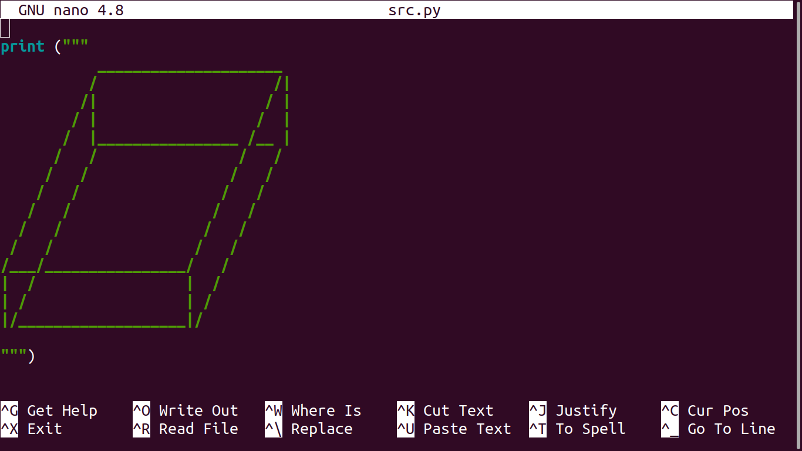
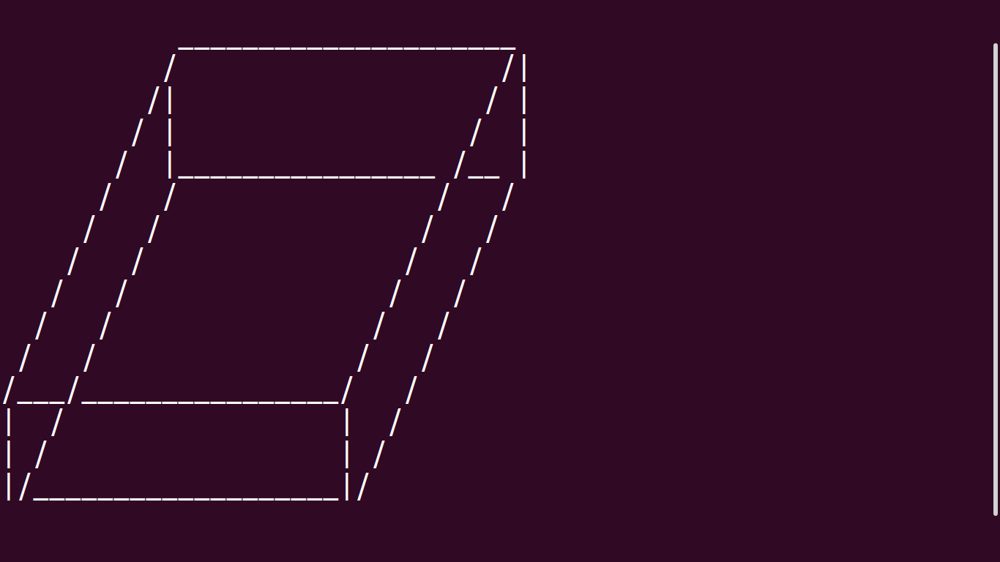

# 3D-shape-in-python
draw a 3D square using Python!

see result in nano editor
--------------------------

## see output in terminal

~~~~~~~~~~~~~~~~~~~~~~~
Hello new beutifull World
~~~~~~~~~~~~~~~~~~~~~~~
